# DWWM DIJON 2022 - KeePass

> KeePass est un coffre-fort de mots de passe, il permet de chiffrer et déchiffrer une base de données (un fichier `.kdbx`), et de le protéger par un seul **Mot de Passe Maître**. Il permet de générer des mots de passe forts et systématiquement différents pour tous les services Web auxquels vous vous inscrirez. KeePass est **le** logiciel recommandé par l'[ANNSI](https://www.annsi.org/) (l'Agence nationale de la sécurité des systèmes d'information).

## Téléchargez et installez KeePass

- Dans la barre d'adresse de votre navigateur Microsoft Edge, tapez `https://keepass.info/download.html` :

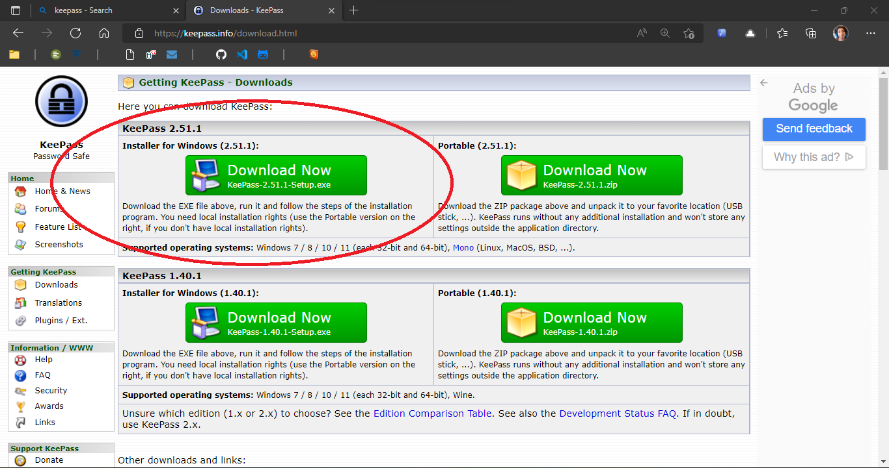

- Exécutez le fichier d'installation téléchargé : 

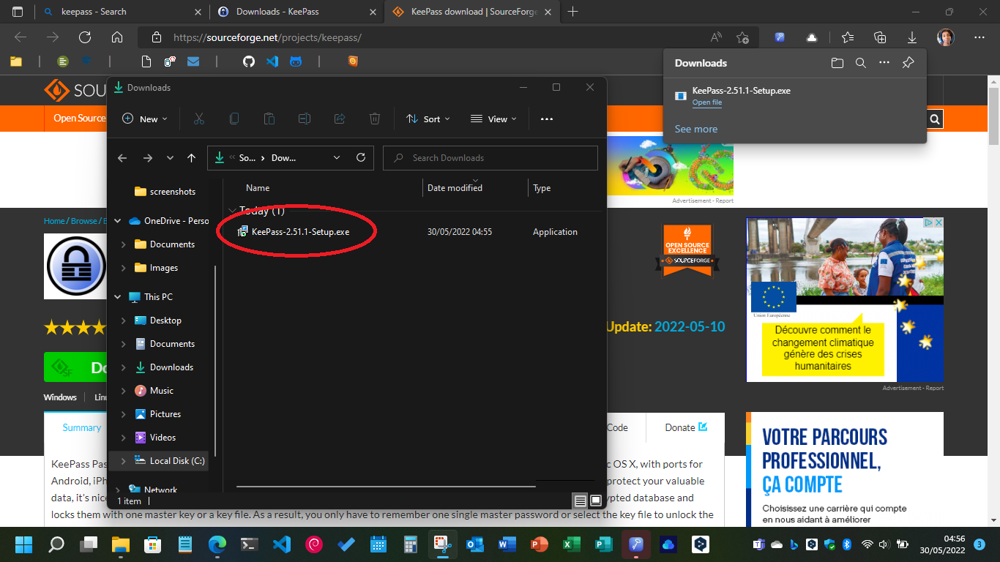

- Laissez toutes les valeurs par défaut durant le processus d'installation : 

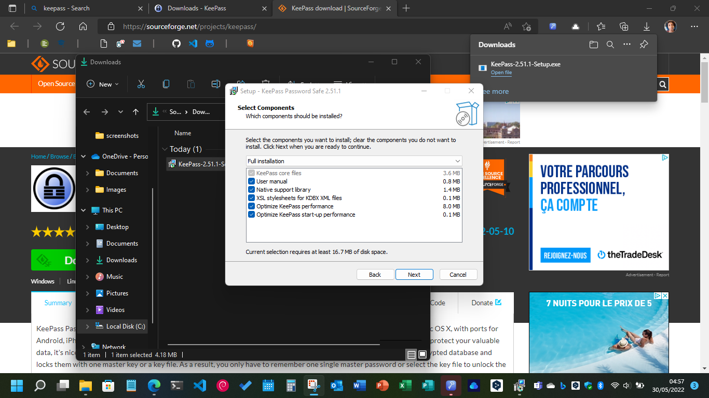

- Acceptez que KeePass recherche automatiquement des mises-à-jour : 

## Configurez KeePass

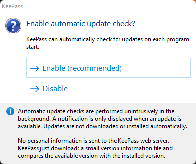

- Dans votre répertoire `OneDrive`, à la racine (au même niveau que les dossiers `Documents` et `Images`), créez un nouveau dossier que vous nommerez « `DB-PSWD` » :

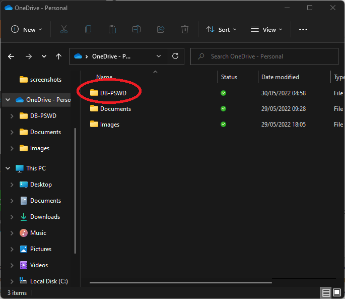

- Lancez l'application KeePass, et créez une nouvelle base de données :

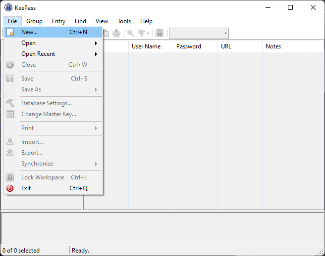

- Répondez « OK » aux instructions. 😊

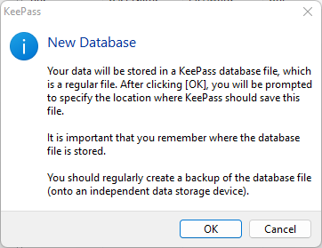

- Nommez votre fichier `.kdbx` :

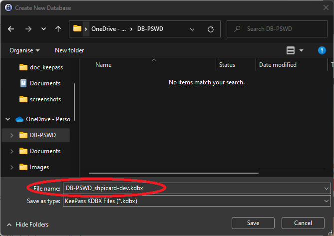

- Vous devez ensuite créé votre mot de passe. Le plus simple, c'est de choisir une suite de cinq mots qui n'ont pas de rapports entre eux, de remplacer certains caractères par des chiffres qui leurs ressemble (le « leet speak »), et de séparer ces mots par un caractère spécial, ou une suite de caractère spéciaux que vous retiendrez.

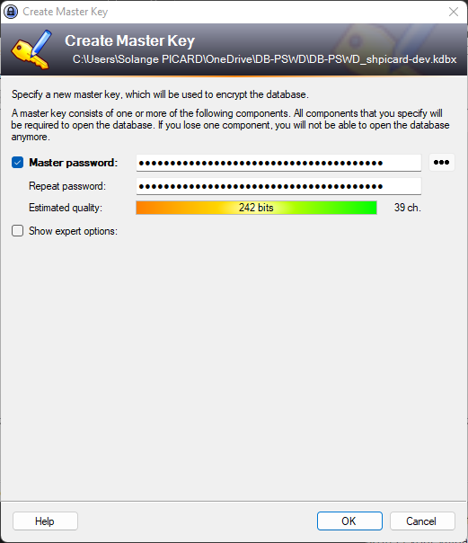

> ⚠️ Vous ne pouvez pas vous permettre d'oublier ce mot de passe. Votre fichier `.kdbx` est impossible à ouvrir sans votre mot de passe maître.

- Donnez un nom à votre base de données :

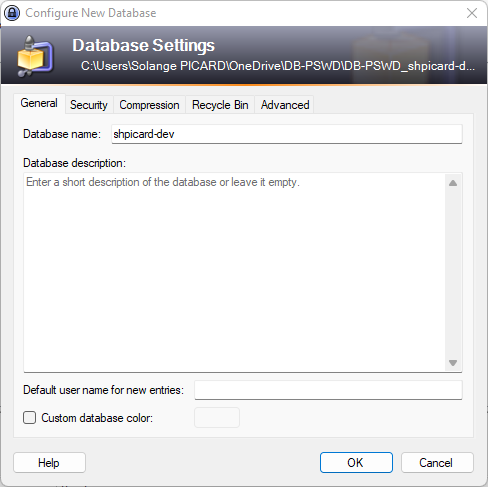

- Vous pouvez éditez une page avec votre mot de passe maître en clair. À vos risques et périls...

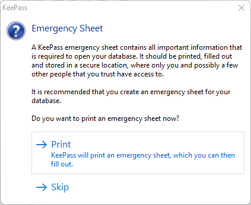

## Sauvegardez vos mots de passe

- Créez une nouvelle entrée : 

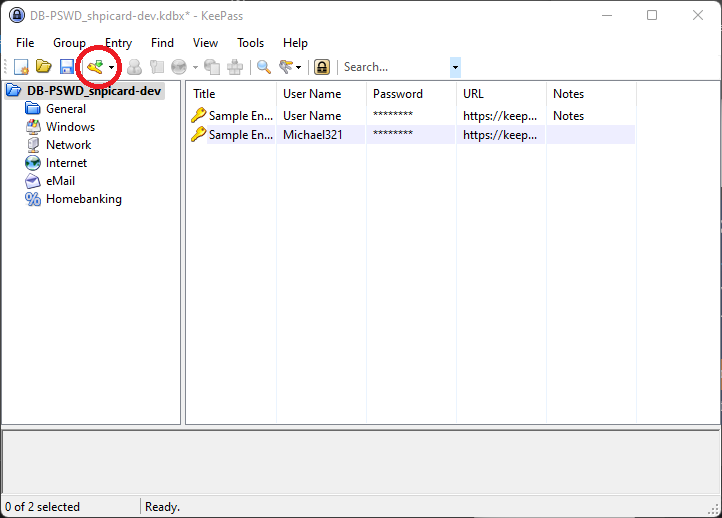

- Donnez lui un titre (le nom du service), renseignez le nom d'utilisateur avec lequel vous vous êtes inscrit à ce service, renseignez le mot de passe que vous avez paramétré pour ce service (les 3 points noirs permettent d'afficher le mot de passe), et renseignez l'url du service. Si vous le souhaitez, KeePass fournit un générateur de mots de passe aléatoire, il suffit de cliquer sur la petite clé entourée ci-dessous :

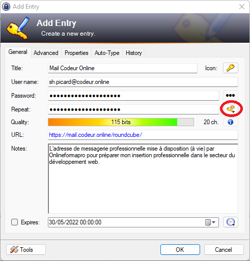

- Le générateur de mots de passe (choisissez le nombre et les types de caractères, et appuyez sur `OK`) : 

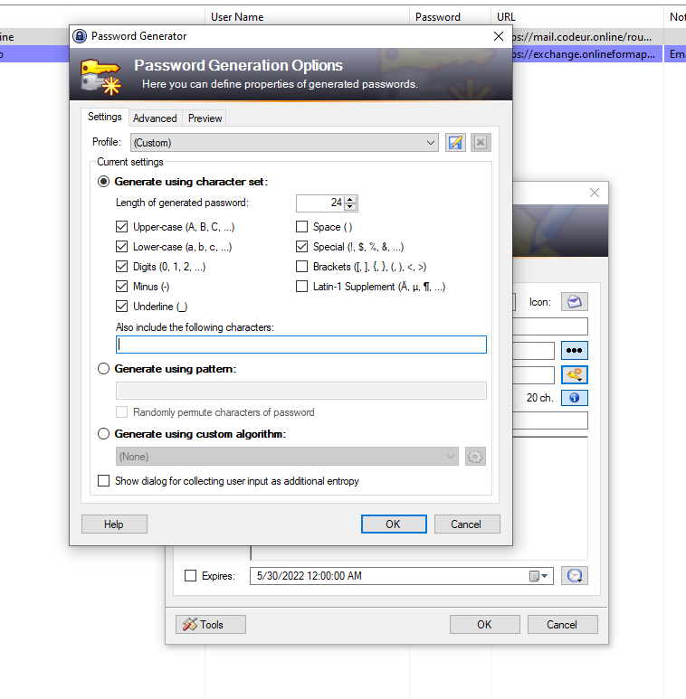

- 🎉 C'est réussi ! Il ne vous reste plus qu'à l'utiliser au quotidien. Quand on s'y met sérieusement, on ne peut plus s'en passer ! Mais c'est surtout une recommandation de sécurité, et ce type de pratiques fait partie des prérequis de base pour un professionnel du développement Web !

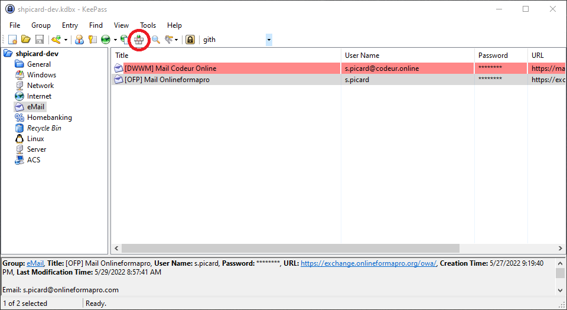

## [Pour aller plus loin] Cachez votre répertoire contenant votre base de données

> Lorsque vous avez ouvert votre base de données `.kdbx` avec KeePass, l'application sait où la retrouver. Inutile de complexifier votre environnement avec des fichiers avec lesquels vous n'interragirez pas directement, puisque seule une application les exploite.

- Faites un clic droit > Propriétés sur le répertoire `DB-PSWD` :

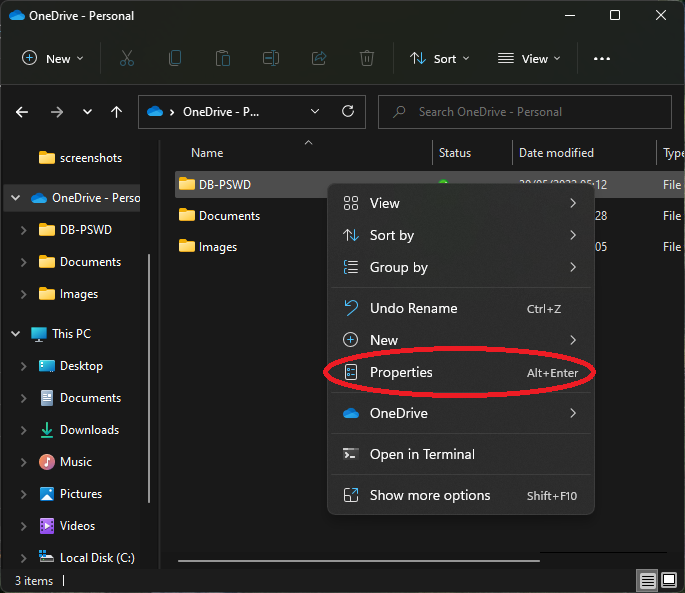

- Cochez la *checkbox* « `Caché` » :

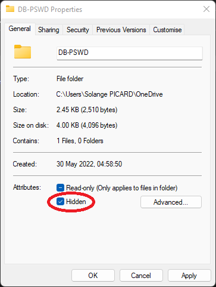

- Et dites de n'appliquer le changement qu'à ce dossier :

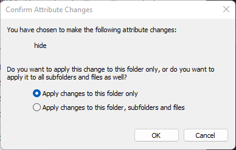

